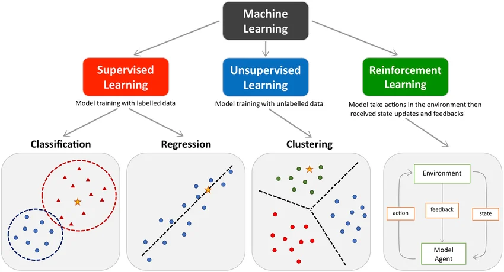
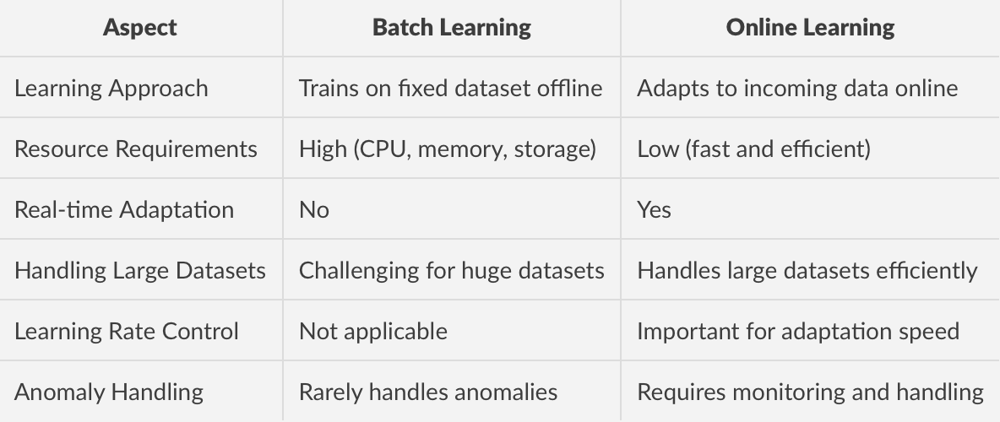
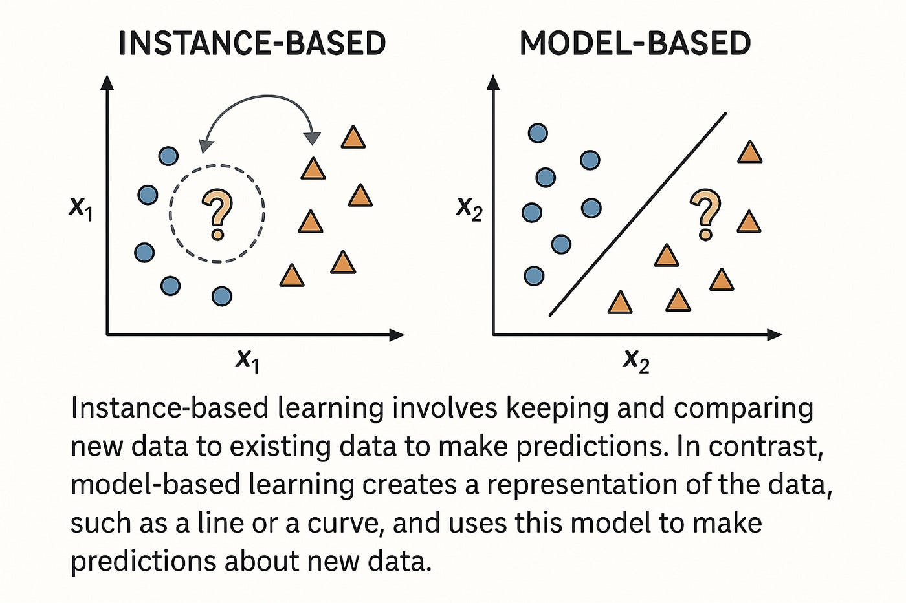
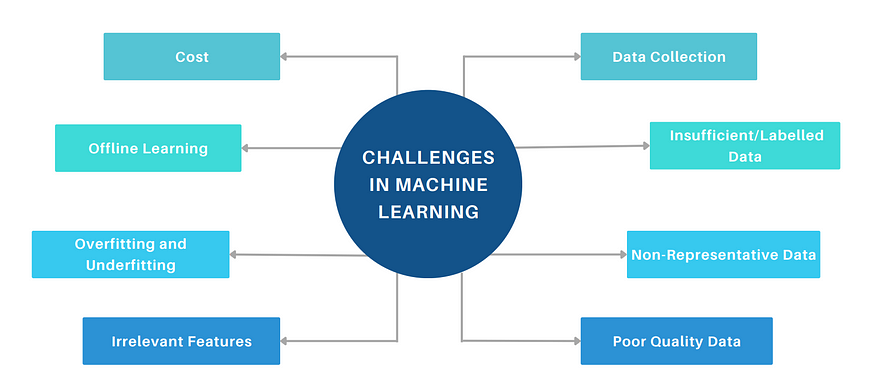
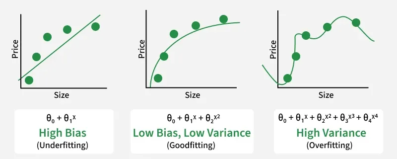
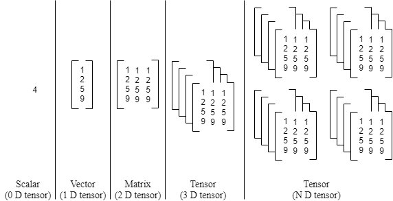

### **Artificial Intelligence (AI)**, **Machine Learning (ML)**, and **Deep Learning (DL)** are nested concepts. The easiest way to visualize their relationship is as a set of concentric circles: AI is the outermost umbrella, ML is a subset within AI, and DL is a deeper subset within ML.


## 1. Artificial Intelligence (AI)

AI is the broadest discipline aimed at creating machines or systems capable of mimicking human intelligence to perform complex tasks, make decisions, or solve problems.

* **Core Objective:** To simulate human cognitive functions (like learning, reasoning, and problem-solving).
* **Historical Approach (Symbolic AI):** Early AI heavily relied on **Expert Systems** or rule-based logic [03:15](http://www.youtube.com/watch?v=1v3_AQ26jZ0&t=195). Human experts programmed explicit "if-then" rules into software.
* **Limitation:** While highly functional for structured, closed problems like playing chess [03:36](http://www.youtube.com/watch?v=1v3_AQ26jZ0&t=216), symbolic AI fails when faced with "fuzzy logic" or highly variable real-world scenarios—such as recognizing a dog in a photo, where rigid rules cannot easily capture every visual variation [04:10](http://www.youtube.com/watch?v=1v3_AQ26jZ0&t=250).


## 2. Machine Learning (ML)

Machine Learning is a subset of AI that moves away from explicit rule-based programming. Instead, it uses statistical methods to enable computers to find underlying patterns and learn directly from data [05:09](http://www.youtube.com/watch?v=1v3_AQ26jZ0&t=309).

* **Core Shift:** Instead of manually writing the code or rules, you input **Data + Expected Outputs** into the system, and the algorithm mathematically deduces the rules or patterns itself [05:39](http://www.youtube.com/watch?v=1v3_AQ26jZ0&t=339).
* **How it Works:** If you want an ML model to identify a dog, you feed it thousands of diverse dog images. The system learns the mathematical patterns common among those photos [06:34](http://www.youtube.com/watch?v=1v3_AQ26jZ0&t=394).
* **Limitation (Feature Engineering):** Traditional ML requires human engineers to explicitly define and extract features from the data before feeding it to the algorithm [10:33](http://www.youtube.com/watch?v=1v3_AQ26jZ0&t=633). For instance, to classify images, a human might have to pre-define visual metrics like ear shapes, snout length, or textures to help the model learn [10:44](http://www.youtube.com/watch?v=1v3_AQ26jZ0&t=644).


## 3. Deep Learning (DL)

Deep Learning is a specialized subfield of Machine Learning that is structurally inspired by the interconnected layout of biological neurons in the human brain, though it fundamentally functions as a dense mathematical stack [09:33](http://www.youtube.com/watch?v=1v3_AQ26jZ0&t=573).

* **Core Mechanics:** DL relies on **Artificial Neural Networks (ANNs)** with many layers (hence the term "Deep") [09:53](http://www.youtube.com/watch?v=1v3_AQ26jZ0&t=593).
* **The Key Breakthrough (Automatic Feature Extraction):** Unlike traditional ML, Deep Learning completely eliminates the need for manual feature engineering [11:14](http://www.youtube.com/watch?v=1v3_AQ26jZ0&t=674). You feed raw data (like an image) directly into the neural network, and successive layers automatically detect lower-level features (like edges and curves) and combine them into higher-level features (like eyes, nose, or a full face) [12:14](http://www.youtube.com/watch?v=1v3_AQ26jZ0&t=734).
* **Data Dependency:** Deep Learning models thrive on massive datasets. While traditional ML models tend to hit a performance plateau even if you feed them more data, DL performance continuously scales upward as data volume expands [13:33](http://www.youtube.com/watch?v=1v3_AQ26jZ0&t=813).

<br>
<br>

## Quick Comparison Summary

| Attribute | Artificial Intelligence (AI) | Machine Learning (ML) | Deep Learning (DL) |
| --- | --- | --- | --- |
| **Scope** | Entire universe of making machines intelligent. | Subset of AI focused on learning from data. | Subset of ML utilizing deep neural networks. |
| **Human Intervention** | High (in early symbolic AI) to define every logic path. | Medium; requires humans to extract data features. | Low; extracts data features automatically. |
| **Data Requirement** | Can function on minimal data (rule-based). | Performs well on small-to-medium datasets. | Requires massive amounts of data to excel. |
| **Ideal For** | Broad system logic, strategy games, general automation. | Structured tabular data, banking, insurance analytics [15:04](http://www.youtube.com/watch?v=1v3_AQ26jZ0&t=904). | Complex unstructured data (Computer Vision, NLP). |


<br>
<br>


# Types of Machine Learning 

## There are 4 Types of Machine Learning

Based on how much external human supervision the system receives during training, ML is split into four paths:

* **1. Supervised Learning (Labeled Data):** The model is trained on a dataset containing both inputs and correct output answers.
    * **Regression:** Predicts a continuous numerical value (e.g., house prices).
    * **Classification:** Predicts a categorical group or discrete class (e.g., "Spam" vs. "Not Spam").


* **2. Unsupervised Learning (Unlabeled Data):** The dataset contains only inputs with no pre-defined answers. The model mines for hidden structures:
    * **Clustering:** Groups similar data points together (e.g., customer segments).
    * **Dimensionality Reduction:** Compresses many data columns down into fewer, key dimensions.
    * **Anomaly Detection:** Flags rare data deviations (e.g., credit card fraud).
    * **Association Learning:** uncovers item co-occurrences (e.g., supermarket product placement).


* **3. Semi-Supervised Learning (Mixed Data):** Combines a small amount of expensive labeled data with a massive pile of unlabeled data.
    * *Example:* **Google Photos** groups visually similar faces automatically (unsupervised) and labels the entire group once you provide a single name (supervised).


* **4. Reinforcement Learning (Trial & Error):** No initial training data is provided. An autonomous **Agent** interacts with an **Environment** and learns to optimize its choices by collecting **Rewards** for correct moves and **Penalties** for mistakes. Used in robotics and systems like AlphaGo.



<br>
<br>

# Offline Learning VS Online Learning

## Batch Learning (Offline Learning)
### 1. Definitions

* **Production Environment:** The real-world server where your final code runs and interacts with actual customers `[00:01:22]`.
* **Batch Learning (Offline Learning):** A conventional approach where a machine learning model is trained using the entire dataset all at once, rather than in continuous, incremental steps `[00:02:17]`.

---

### 2. Workflow & Core Concept

* **Offline Training:** Because training on a massive dataset is computationally heavy and slow, it is done offline by engineers on local machines or dedicated servers `[00:03:09]`.
* **Static Model:** Once uploaded to the production server, the model becomes fixed. It uses what it has already learned to make predictions but cannot learn from new, incoming data on its own `[00:04:40]`.
* **Periodic Updates:** To prevent the model from becoming obsolete (e.g., a movie recommendation engine missing newly released films), developers must periodically combine old data with new data and retrain a brand-new model from scratch (e.g., every 24 hours, weekly, or monthly) `[00:05:58]`.

---

### 3. Main Disadvantages

* **Hardware & Scaling Bottlenecks:** As data grows exponentially over time, retraining a model on the *entire* dataset at once can eventually overwhelm system memory and crash your hardware `[00:07:45]`.
* **Connectivity Issues:** It fails in environments with limited or no internet access (e.g., remote locations, tracking satellites), where you cannot easily push frequent server updates `[00:08:23]`.
* **Slow Adaptation to Trends:** Because updates rely on a set schedule, the system cannot react to sudden real-time events or viral shifts instantly. By the time the next batch update runs, the trend may already be irrelevant `[00:09:39]`.



## Online learning

This lecture by [CampusX](http://www.youtube.com/watch?v=3oOipgCbLIk) covers the concept of **Online Machine Learning**, contrasting it with Batch (Offline) Learning, exploring its applications, implementation strategies, and associated risks.

Here is a summary of the key definitions and key points to remember from the lecture, with timestamps removed:

---

### 1. Definition

* **Online Machine Learning** is an incremental learning technique where a model is trained sequentially as data arrives, rather than all at once.
* Instead of retraining the whole model on the entire dataset (which is computationally expensive), the model updates its weights dynamically on the server or in production using small streams or chunks of data called **mini-batches**.

### 2. When to Use Online Learning

You should opt for Online Learning under the following scenarios:

* **Concept Drift:** When the nature of the problem or underlying data patterns change dynamically over time (e.g., changing consumer behavior on e-commerce platforms during a festive sale).
* **Cost Efficiency:** Retraining massive datasets using batch learning repeatedly is incredibly expensive. Online learning processes data in tiny chunks, reducing computation overhead.
* **Fast / Dynamic Solutions:** When the application demands real-time responsiveness to user interactions.
* **Out-of-Core Learning:** When you have a massive dataset (e.g., $50\text{ GB}$) that exceeds your system's memory capacity (e.g., $8\text{ GB}$ RAM). Online learning allows you to load and train on small chunks sequentially.

### 3. Real-World Examples

* **Smart Keyboards (e.g., SwiftKey):** Adapts and personalizes text predictions dynamically as you type.
* **Recommendation Feeds (e.g., YouTube):** If you click a specific video, your home feed updates with related content immediately upon returning to the home screen.
* **AI Assistants / Chatbots:** Continuous learning from live user queries to optimize conversational accuracy.

### 4. Implementation Tools & Code Logic

* **Scikit-Learn (`partial_fit`):** Standard batch algorithms use `.fit()`. However, Online Learning algorithms like `SGDRegressor` use the `.partial_fit()` method, which allows you to continually pass fresh data and update the existing model state incrementally without losing prior learning.
* **Dedicated Streaming Libraries:** Libraries like [River](https://github.com/online-ml/river) (a Python library explicitly built for streaming data) and **Vowpal Wabbit** are excellent industry choices for complex online learning tasks.

---

### 💡 Key Points to Remember

> ⚠️ **The Learning Rate ($\eta$) Dilemma**
> Setting the correct learning rate is the hardest part of online learning.
> * If it is **too fast**, the model suffers from catastrophic forgetting (it learns new data too fast and completely forgets old patterns).
> * If it is **too slow**, the model reacts poorly to live trend changes.
> 
> 

> 🛡️ **Security and Data Poisoning Risk**
> Because the model learns continuously from incoming server data, it is vulnerable to malicious data injections or server anomalies. If garbage or biased data is fed into the pipeline, the model's behavior will quickly decay.
> * *Fix:* You **must** build automated anomaly detection layers to screen live data, closely monitor performance, and have a rollback strategy to revert the model to a previous stable state if it misbehaves.
> 
> 

---

### Comparison Summary: Online vs. Offline (Batch) Learning

| Feature | Offline / Batch Learning | Online Learning |
| --- | --- | --- |
| **Data Processing** | Processes data all at once in a bulk dataset. | Processes data continuously and incrementally . |
| **System Complexity** | Lower complexity; trained offline and deployed to only make predictions. | Higher complexity; must continually learn, predict, and be monitored live. |
| **Best Suited For** | Static data where patterns don't change frequently (e.g., Cat vs. Dog classifier). | Volatile environments with fluctuating trends (e.g., Stock prediction, live recommendation systems). |

<br>
<br>

# Instance-Based Vs Model-Based Learning

## Core Overview

The lecture focuses on how different Machine Learning (ML) algorithms learn from data. Just like humans learn either by **memorization (rote learning)** or **generalization (understanding the concept)**, machine learning models fall into two primary categories based on their learning approach: **Instance-Based Learning** and **Model-Based Learning**.


## 1. Instance-Based Learning

```
[ Training Data ] 
       │
       ▼  (Stored directly into memory without changes)
[ Database / Storage ] 
       │
       ├─◄─ [ New Query Instance ] (An unseen data point arrives)
       ▼
[ Similarity / Distance Measure ] (e.g., calculates closest neighbors)
       │
       ▼
[ Prediction / Output ] (Based on majority vote or average of neighbors)

```

### Brief Definition

Instance-Based Learning is an approach where the system learns the training examples by heart (memorization) and generalizes to new instances on-the-fly based on a similarity measure (e.g., distance). It is also famously referred to as **Lazy Learning** because the model does no real work during the training phase.

### Key Points :

* **No Explicit Training Phase:** The algorithm does not construct an abstract model or rule during training; it simply stores the raw training data as-is.
* **Similarity-Driven:** When a new query point is introduced, the algorithm calculates its similarity or distance (e.g., Euclidean distance) to all stored data points to predict the outcome.
* **Example Given:** **K-Nearest Neighbors (KNN)** is a classic example. If a new student's data is plotted, the algorithm looks at the closest neighbors to determine whether the student will get placed or not based on majority voting.

---

## 2. Model-Based Learning

### Phase 1: Training Phase

```
[ Training Data ] ──► [ Learning Algorithm ] ──► [ Optimized Parameters / Model Formula ]

```

### Phase 2: Prediction Phase

```
[ New Query Instance ] ──► [ Optimized Model Formula ] ──► [ Prediction / Output ]

``` 


### Brief Definition

Model-Based Learning is an approach where the system tries to extract an underlying pattern, rule, or concept from the training data to build a predictive mathematical function (or decision boundary).

### Key Points :

* **Builds a Decision Boundary:** Instead of keeping the data points, the algorithm optimizes a set of mathematical parameters to draw a permanent boundary separating classes.
* **Data-Independent Post Training:** Once the mathematical function (model) is built and saved, the training data can be completely deleted. Predictions depend entirely on the calculated formula.
* **Examples Given:** Linear Regression, Logistic Regression, and Decision Trees are primary examples where relationships are reduced to equations or structured rules.


## Key Differences Summary

The lecture concludes with a direct comparison between the two approaches across several critical performance metrics:

| Metric / Feature | Model-Based Learning | Instance-Based Learning |
| --- | --- | --- |
| **Primary Mechanism** | Extracts a generalized rule or formula. | Memorizes and holds onto individual instances. |
| **Data Dependency** | Training data can be discarded after the model is trained. | Training data **must** be kept indefinitely to make predictions. |
| **When Generalization Happens** | Before scoring; creates a global rule for all future incoming data. | Only at the moment of scoring; local rules adapt uniquely per query point. |
| **Storage Requirements** | **Low Storage:** Only saves a few parameters or equations. | **High Storage:** Needs memory proportional to the size of the entire dataset. |
| **Computation Speed** | Slow training phase, but extremely fast prediction phase. | No training phase (instant), but slower prediction phase due to distance calculations. |


### Key Structural Difference

* **Instance-Based:** $\text{New Data} \longrightarrow \text{All Training Data} \longrightarrow \text{Output}$
* **Model-Based:** $\text{New Data} \longrightarrow \text{Mathematical Formula} \longrightarrow \text{Output}$

<br>
<br>

# Challenges In Machine learning - 


### 1. Data Collection

* **Definition:** The process of gathering raw data from various sources (e.g., APIs, databases, web scraping) to train machine learning models.
* **Keypoints:** While working on educational or small-scale hobby projects provides easily accessible datasets (like CSV files on Kaggle), collecting data for production-level industry applications is highly difficult.

### 2. Insufficient Data & Labeled Data

* **Definition:** The bottleneck where a model lacks enough overall training examples or struggles because the collected data lacks correct target tags/labels.
* **Keypoints:** Having massive amounts of data can sometimes make up for a weaker algorithm—a concept known as the *unreasonable effectiveness of data*. However, most real-world scenarios suffer from medium-to-low dataset sizes. Furthermore, manually labeling data (e.g., separating images of cats vs. dogs) is incredibly tedious and time-consuming.

### 3. Non-Representative Data

* **Definition:** A flaw occurring when the training data sample fails to accurately mirror the real-world distribution of the population the model is trying to make predictions on.
* **Keypoints:** If your training data only shows "half the story," your predictions will fail on new data. This manifests as **Sampling Noise** (unintentional variance from small samples) or **Sampling Bias** (systemic faults in sample selection, such as polling only cricket fans in India to see who will win the World Cup).

### 4. Poor Quality Data

* **Definition:** Datasets riddled with errors, outliers, noise, missing values, or inconsistent formatting.
* **Keypoints:** Machine learning is heavily dependent on data quality. In actual data science projects, practitioners spend nearly **60% to 80% of their total time** performing data cleaning and recycling raw, noisy data into clean formats.

### 5. Irrelevant Features (Garbage In, Garbage Out)

* **Definition:** Including variables or columns in a dataset that do not add any predictive value or relate to the target output.
* **Keypoints:** Feeding useless attributes (e.g., using a person's geographic location to predict their marathon running performance) actively degrades model performance. Engineers combat this through **Feature Engineering**—combining or transforming columns (example - like turning height and weight into BMI) to give the model better signals.

### 6. Overfitting

* **Definition:** A scenario where a machine learning model learns the training data too perfectly, essentially "memorizing" individual points rather than understanding the underlying patterns.
* **Keypoints:** Overfitted models yield exceptionally high accuracy on training sets but fail to generalize when exposed to unseen test data. The model treats noise as a core pattern, clinging too rigidly to specific data coordinates.

### 7. Underfitting

* **Definition:** The exact opposite of overfitting; occurs when a model is too simple to capture the structural trends inherent within the data.
* **Keypoints:** An underfitted model performs poorly on *both* the training data and new test data. Striking a balance between underfitting and overfitting is a primary objective when selecting model architectures.



### 8. Software Integration

* **Definition:** The complex engineering task of taking an isolated machine learning model and embedding it natively into an existing production software environment.
* **Keypoints:** Models do not run in a vacuum; they must live inside apps, websites, or edge hardware. Compatibility issues across operating systems (Windows, Android, Linux) and popular development ecosystems make this highly challenging. Stable ML toolings for core backend frameworks like Java or Frontend JavaScript (e.g., TensorFlow.js) are still structurally maturing.

### 9. Offline Learning vs. Deployment

* **Definition:** The operational friction points of moving a model to a production server and managing updates.
* **Keypoints:** Many models rely on static offline learning (the model is trained once, deployed, and cannot adapt unless it is taken offline, retrained with new data, and redeployed). Deploying models through cloud services like AWS or Azure requires ongoing monitoring, which is still significantly less streamlined than traditional software deployment.

### 10. Cost Involved

* **Definition:** The financial overhead generated by computationally intensive model training, cloud compute infrastructure, and server data hosting.
* **Keypoints:** Running large-scale models at high user volumes scales cloud costs rapidly. Because of these hidden expenses, companies often limit what algorithms can be deployed. This intersection of managing deployment pipelines, costs, and infrastructure has given rise to the rapidly growing discipline of **MLOps (Machine Learning Operations)**.

<br>
<br>

# Application of Machine Learning - 

The primary objective of this lecture is to shift the perspective from standard consumer-facing applications **(Business-to-Consumer or B2C**, like YouTube or Amazon recommendations) toward **Business-to-Business (B2B)** applications, showing how machine learning (ML) acts as a backbone for industry profitability, operations, and strategic decision-making.

## 1. Retail & E-Commerce

* **Demand Forecasting:** Predicting which products will trend before massive sales events so companies only stock high-demand items, saving millions in warehousing costs.
* **Customer Profiling:** Tracking purchasing behavior via customer phone numbers to build distinct lifestyle profiles (e.g., health-conscious) for highly targeted ad conversions.
* **Market Basket Analysis:** > **Definition:** Finding hidden co-relations between products based on what customers frequently buy together.
* **Keypoint:** This dictates physical shelf or digital layout optimization to trigger spontaneous cross-purchasing.


## 2. Banking and Finance

* **Credit Risk Assessment:** Running customer profiles through ML models to compare them against historical default data. If a high correlation to past defaulters is found, the system flags a risk and rejects the loan.
* **Expansion Strategy:** Analyzing demographic data to determine the most profitable locations to open new branches and launch localized financial products.


## 3. Transportation and Logistics

* **Dynamic / Surge Pricing:** > **Definition:** Adjusting the cost of a service in real-time based on immediate supply and demand metrics.
* **Keypoint:** When passenger demand outpaces available drivers, prices spike. This premium acts as a financial incentive to draw nearby drivers into high-demand areas.


* **Route Optimization:** Generating the most efficient multi-stop delivery routes to minimize fuel consumption and transit time.


## 4. Manufacturing Sector

* **Predictive Maintenance:** > **Definition:** Monitoring equipment metrics (like temperature and RPM) using IoT sensors to predict and fix machinery failures before they happen.
* **Keypoint:** Enables automated factories to repair critical robotic machinery during off-hours, entirely avoiding costly, unplanned production halts.


## 5. Consumer Internet & Sentiment Analysis

Platforms that harvest vast textual data leverage natural language processing to extract market intelligence.

* Sentiment Analysis:
    * **Definition** : The process of computationally identifying and categorizing opinions expressed in text to determine whether the user's attitude toward a specific topic is positive, negative, or neutral Opens in a new window.

    * **Real world example** : Public platforms like Twitter leverage sentiment tracking during major   global events (such as political elections or entertainment releases) By processing public sentiment, platforms can create a real-time repository of human intelligence that is highly valuable to stock brokers, hedge funds, and market researchers aiming to make predictive investments before official results drop.


<br>
<br>

# Machine Learning Development Life Cycle - 


# Machine Learning Lifecycle

## Step 1: Problem Definition
The first step is identifying and clearly defining the business problem. A well-framed problem provides the foundation for the entire lifecycle. Important things like project objectives, desired outcomes and the scope of the task are carefully designed during this stage.

* Collaborate with stakeholders to understand business goals
* Define project objectives, scope and success criteria
* Ensure clarity in desired outcomes

---

## Step 2: Data Collection
Data Collection phase involves systematic collection of datasets that can be used as raw data to train model. The quality and variety of data directly affect the model’s performance.

Here are some basic features of Data Collection:

* **Relevance:** Collect data should be relevant to the defined problem and include necessary features.
* **Quality:** Ensure data quality by considering factors like accuracy and ethical use.
* **Quantity:** Gather sufficient data volume to train a robust model.
* **Diversity:** Include diverse datasets to capture a broad range of scenarios and patterns.

---

## Step 3: Data Cleaning and Preprocessing
Raw data is often messy and unstructured and if we use this data directly to train then it can lead to poor accuracy. We need to do data cleaning and preprocessing which often involves:

* **Data Cleaning:** Address issues such as missing values, outliers and inconsistencies in the data.
* **Data Preprocessing:** Standardize formats, scale values and encode categorical variables for consistency.
* **Data Quality:** Ensure that the data is well-organized and prepared for meaningful analysis.

---

## Step 4: Exploratory Data Analysis (EDA)
To find patterns and characteristics hidden in the data Exploratory Data Analysis (EDA) is used to uncover insights and understand the dataset's structure. During EDA patterns, trends and insights are provided which may not be visible by naked eyes. This valuable insight can be used to make informed decision.

Here are the basic features of Exploratory Data Analysis:

* **Exploration:** Use statistical and visual tools to explore patterns in data.
* **Patterns and Trends:** Identify underlying patterns, trends and potential challenges within the dataset.
* **Insights:** Gain valuable insights for informed decisions making in later stages.
* **Decision Making:** Use EDA for feature engineering and model selection.

---

## Step 5: Feature Engineering and Selection
Feature engineering and selection is a transformative process that involve selecting only relevant features to enhance model efficiency and prediction while reducing complexity.

Here are the basic features of Feature Engineering and Selection:

* **Feature Engineering:** Create new features or transform existing ones to capture better patterns and relationships.
* **Feature Selection:** Identify subset of features that most significantly impact the model's performance.
* **Domain Expertise:** Use domain knowledge to engineer features that contribute meaningfully for prediction.
* **Optimization:** Balance set of features for accuracy while minimizing computational complexity.

---

## Step 6: Model Selection
For a good machine learning model, model selection is a very important part as we need to find model that aligns with our defined problem, nature of the data, complexity of problem and the desired outcomes.

Here are the basic features of Model Selection:

* **Complexity:** Consider the complexity of the problem and the nature of the data when choosing a model.
* **Decision Factors:** Evaluate factors like performance, interpretability and scalability when selecting a model.
* **Experimentation:** Experiment with different models to find the best fit for the problem.

---

## Step 7: Model Training
With the selected model the machine learning lifecycle moves to model training process. This process involves exposing model to historical data allowing it to learn patterns, relationships and dependencies within the dataset.

Here are the basic features of Model Training:

* **Iterative Process:** Train the model iteratively, adjusting parameters to minimize errors and enhance accuracy.
* **Optimization:** Fine-tune model to optimize its predictive capabilities.
* **Validation:** Rigorously train model to ensure accuracy to new unseen data.

---

## Step 8: Model Evaluation and Tuning
Model evaluation involves rigorous testing against validation or test datasets to test accuracy of model on new unseen data. It provides insights into model's strengths and weaknesses. If the model fails to acheive desired performance levels we may need to tune model again and adjust its hyperparameters to enhance predictive accuracy.

Here are the basic features of Model Evaluation and Tuning:

* **Evaluation Metrics:** Use metrics like accuracy, precision, recall and F1 score to evaluate model performance.
* **Strengths and Weaknesses:** Identify the strengths and weaknesses of the model through rigorous testing.
* **Iterative Improvement:** Initiate model tuning to adjust hyperparameters and enhance predictive accuracy.
* **Model Robustness:** Iterative tuning to achieve desired levels of model robustness and reliability.

---

## Step 9: Model Deployment
Now model is ready for deployment for real-world application. It involves integrating the predictive model with existing systems allowing business to use this for informed decision-making.

Here are the basic features of Model Deployment:

* Integrate with existing systems
* Enable decision-making using predictions
* Ensure deployment scalability and security
* Provide APIs or pipelines for production use

---

## Step 10: Model Monitoring and Maintenance
After Deployment models must be monitored to ensure they perform well over time. Regular tracking helps detect data drift, accuracy drops or changing patterns and retraining may be needed to keep the model reliable in real-world use.

Here are the basic features of Model Monitoring and Maintenance:

* Track model performance over time
* Detect data drift or concept drift
* Update and retrain the model when accuracy drops
* Maintain logs and alerts for real-time issues


<br>
<br>


# Data Science and Machine learning JOB Roles -


## 📊 Updated Data Job Roles & Market Comparison (2026)

| Job Title | Analytical Skills | Business Acumen | Data Storytelling | Soft / Comm. Skills | Software Engg. / DSA | System Design / Cloud | **Average U.S. Base Salary (2026)** |
| --- | --- | --- | --- | --- | --- | --- | --- |
| **Data Analyst** | High | Medium to High | **Very High** *(Crucial)* | Medium to High | Low | None | **$84,000 – $90,000** |
| **Data Engineer** | Medium | Low / Agnostic | None | Medium | **Very High** | **Very High** | **$137,000 – $185,000** |
| **Data Scientist** | **Very High** | High | High | High | Medium | Low to Medium | **$112,000 – $128,000** |
| **ML Engineer** | Medium to High | Medium | None | High | **Very High** | **Very High** | **$160,000 – $187,000** |

---

## 🔍 Key 2026 Market Context & Salary Factors

* **The ML/AI Premium:** [Machine Learning Engineers](https://www.kore1.com/ml-engineer-salary-guide/) command the highest baseline packages. Because companies are rushing to put AI systems into actual software production, the demand for people who understand LLMOps, model deployment, and distributed computing has outpaced the general talent supply. Total compensation (including equity and bonuses) for senior ML Engineers at top-tier companies regularly pushes past **$350,000**.
* **The Data Infrastructure Crux:** [Data Engineers](https://www.recruitingfromscratch.com/blog/data-engineer-salary-in-2026-real-data-from-200k-job-postings) continue to see incredibly stable, high compensation. Modern AI models are only as good as the data fed into them, meaning specialized "AI Data Engineers" who build real-time vector databases and low-latency streaming pipelines are highly valued.
* **Data Scientist Evolution:** The role of the generalist Data Scientist has split. Those working primarily on traditional statistical business modeling sit around the mid-$120k base mark. However, those specializing in deep learning, Computer Vision, or NLP frequently jump into the ML Engineer tier or higher.
* **Data Analyst Automation:** With modern AI tools drastically cutting down the manual time required to write SQL queries or clean data, [Data Analysts](https://builtin.com/salaries/us/data-analyst) are evaluated much more heavily on their **Business Intelligence (BI)** and **Data Storytelling** capabilities—translating data directly into revenue-generating strategies.

<br>
<br>

# What are Tensors ?

* **Definition:** In its simplest form, a tensor is a **data structure** or a container used to store numbers. In computer science, it is synonymous with a multidimensional array ($N\text{-Dimensional Array}$).
* **Importance:** Leading machine learning libraries like Scikit-Learn, TensorFlow, and PyTorch rely on tensors as their most basic building block to store and process data. In fact, Google’s top deep learning library, *TensorFlow*, derives its name directly from this concept.

### **Types of Tensors and Practical Examples**

The number of dimensions a tensor has is referred to as its **Rank** or **Axis**. The video breaks down the types of tensors from 0D to 5D using real-world applications:

* **0D Tensor (Scalar):** A single number containing no axes (e.g., `7` or `45`). Checking its dimension in NumPy returns `0`.
* **1D Tensor (Vector):** An array or a single list of numbers with one axis.
    * *Machine Learning Example:* In a student dataset with columns like [CGPA, IQ, State], the input data for a **single student** forms a 1D tensor.


* **2D Tensor (Matrix):** A collection of vectors consisting of rows and columns (two axes).
    * *Machine Learning Example:* An **entire tabular dataset** where rows represent multiple individual records (e.g., data for 10,000 students) and columns represent features.


* **3D Tensor:** A collection of multiple 2D matrices layered together.
    * *Machine Learning Examples:* 
    1. **Natural Language Processing (NLP):** Text data converted into vectors where sentences form a matrix of word embeddings.
    2. **Time Series Data:** Stock market data tracked over a timeline (e.g., tracking stock highs and lows daily over a 10-year span).


* **4D Tensor:** A collection of multiple 3D tensors.
    * *Machine Learning Example:* **Image datasets**. A single color image is a 3D tensor consisting of rows, columns, and 3 color channels (RGB). A batch containing multiple color images forms a 4D tensor.


* **5D Tensor:** A collection of multiple 4D tensors.
    * *Machine Learning Example:* **Video data**. Videos are essentially sequences of image frames playing rapidly over time. When processing a batch of multiple videos (Videos × Frames × Height × Width × Channels), the data structure escalates into a 5D tensor.


---

### **Core Properties: Shape and Size**

* **Shape:** Dictates the exact number of elements available along each specific axis (e.g., a shape of `(2, 3)` means 2 rows and 3 columns).
* **Size:** The total count of individual numbers inside a tensor. This is calculated by multiplying all the dimensions of its shape together. For example, a tensor with a shape of `(4, 3, 2)` holds a total size of 24 items.